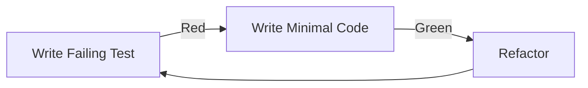

# Test-Driven Development (TDD) Workflow

> Practices for writing tests first and achieving quality through testing.

---

## TDD Cycle: Red → Green → Refactor



### 1. RED: Write a Failing Test
```typescript
// Write test FIRST, before implementation
test('calculates total time from entries', () => {
  const entries = [
    { minutes: 30 },
    { minutes: 45 },
  ]
  
  const total = calculateTotalTime(entries)
  
  expect(total).toBe(75)
})
// ❌ Test fails - function doesn't exist yet
```

### 2. GREEN: Write Minimal Code to Pass
```typescript
// Simplest implementation that makes test pass
function calculateTotalTime(entries: TimeEntry[]): number {
  return entries.reduce((sum, e) => sum + e.minutes, 0)
}
// ✅ Test passes
```

### 3. REFACTOR: Improve Without Breaking
```typescript
// Clean up while keeping tests green
function calculateTotalTime(entries: TimeEntry[]): number {
  if (entries.length === 0) return 0
  return entries.reduce((total, entry) => total + entry.minutes, 0)
}
// ✅ Tests still pass
```

---

## Test Structure: AAA Pattern

```typescript
test('filters active tasks from list', () => {
  // ARRANGE - Setup test data
  const tasks = [
    { id: '1', status: 'active' },
    { id: '2', status: 'done' },
    { id: '3', status: 'active' },
  ]

  // ACT - Execute the function
  const result = filterActiveTasks(tasks)

  // ASSERT - Verify outcome
  expect(result).toHaveLength(2)
  expect(result.every(t => t.status === 'active')).toBe(true)
})
```

---

## Test Naming Convention

```typescript
// Pattern: "should [expected behavior] when [condition]"
test('should return empty array when no tasks match filter', () => {})
test('should throw error when id is invalid', () => {})
test('should update status when moving task to done', () => {})

// Or: "[function] [scenario] [expected result]"
test('filterTasks with empty input returns empty array', () => {})
test('createTask with valid data returns new task', () => {})
```

---

## Test Types & When to Use

| Type | Scope | Speed | When to Write |
|------|-------|-------|---------------|
| **Unit** | Single function | Fast (ms) | Every new function |
| **Integration** | Multiple modules | Medium (s) | API endpoints, DB ops |
| **E2E** | Full user flow | Slow (min) | Critical user journeys |

### Unit Test Example (Rust)
```rust
#[cfg(test)]
mod tests {
    use super::*;
    
    #[test]
    fn test_generate_task_id() {
        let id = generate_id("task");
        assert!(id.starts_with("task-"));
        assert_eq!(id.len(), 9); // "task-" + 4 hex chars
    }
}
```

### Integration Test Example
```typescript
test('creates task and retrieves it', async () => {
  // Create
  const created = await taskService.create({
    title: 'Test Task',
    type: 'feat'
  })
  
  // Retrieve
  const retrieved = await taskService.getById(created.id)
  
  // Verify
  expect(retrieved.title).toBe('Test Task')
})
```

---

## What to Test

### ✅ DO Test:
- **Business logic** - Calculations, transformations
- **Edge cases** - Empty inputs, null values, boundaries
- **Error conditions** - Invalid inputs, failure scenarios
- **State changes** - Before/after mutations

### ❌ DON'T Test:
- Framework internals (React, SolidJS hooks)
- Third-party library behavior
- Trivial getters/setters
- Private implementation details

---

## Test Coverage Guidelines

| Coverage | Target | Notes |
|----------|--------|-------|
| **New code** | 80%+ | Required for features |
| **Bug fixes** | 100% | Must prove bug is fixed |
| **Critical paths** | 90%+ | Auth, payments, data ops |
| **Legacy code** | 60%+ | Add tests when touching |

---

## Common Test Locations

Test files typically live near the code they test:

```
# Rust projects
src/tests.rs              # Module-level tests
src/module/tests.rs       # Submodule tests  
tests/                    # Integration tests

# TypeScript/JavaScript projects
__tests__/                # Jest convention
*.test.ts / *.spec.ts     # Co-located tests
src/__tests__/            # Source-adjacent tests

# Python projects
tests/                    # Top-level test folder
test_*.py / *_test.py     # Test file naming
```

### Running Tests
```bash
# Rust
cargo test --lib              # Unit tests
cargo test --lib module::test # Specific module

# TypeScript/JavaScript
pnpm test                     # or npm test
pnpm test:watch               # Watch mode

# Python
pytest                        # All tests
pytest tests/test_module.py   # Specific file
```

---

## Test-First Checklist

Before implementing a feature:

1. [ ] Write test for expected behavior
2. [ ] Run test - confirm it fails (RED)
3. [ ] Write minimal implementation
4. [ ] Run test - confirm it passes (GREEN)
5. [ ] Refactor if needed
6. [ ] Run tests - confirm still passing

---

## Common Testing Patterns

### Mock External Dependencies
```typescript
// Mock API calls
jest.mock('@/services/api', () => ({
  fetchTasks: jest.fn().mockResolvedValue([{ id: '1' }])
}))
```

### Test Async Operations
```typescript
test('fetches tasks asynchronously', async () => {
  const tasks = await fetchTasks()
  expect(tasks).toHaveLength(1)
})
```

### Test Error Throwing
```typescript
test('throws on invalid input', () => {
  expect(() => validateInput(null)).toThrow('Input required')
})
```

---

## Summary

- ✅ Write test BEFORE implementation
- ✅ Follow AAA pattern (Arrange, Act, Assert)
- ✅ Name tests descriptively
- ✅ Test behavior, not implementation
- ✅ Aim for 80%+ coverage on new code
- ❌ Don't test framework internals
- ❌ Don't skip tests to meet deadlines
