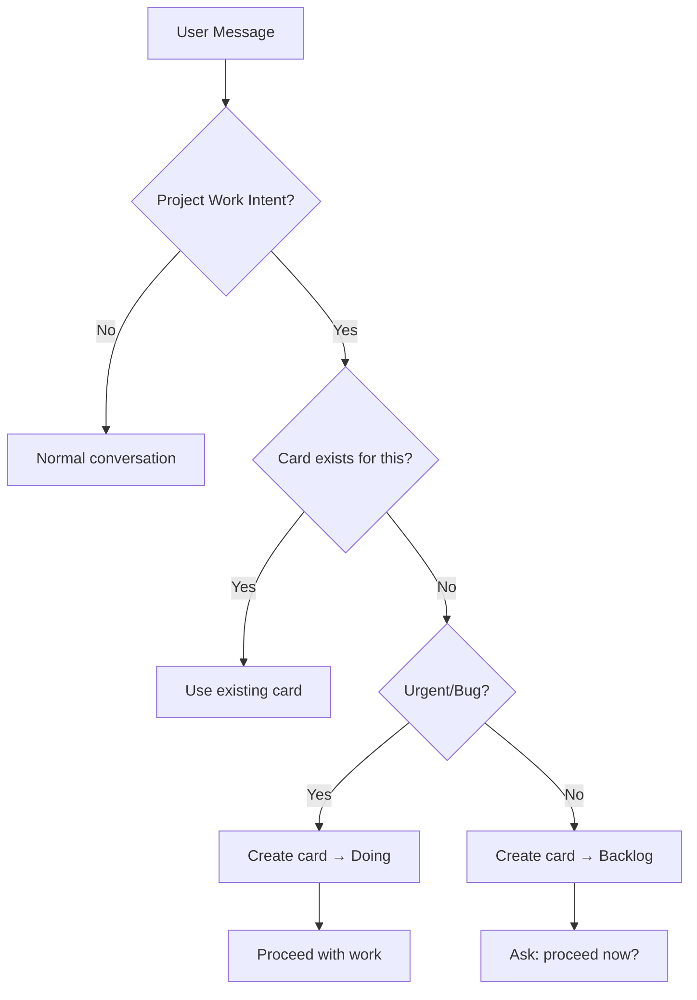

## 🎯 Session Start & Conversation Rules

> [!CAUTION]
> **MANDATORY: Every project work conversation MUST result in a tracked card!**
> AI agents must intelligently detect user intent and create appropriate task cards.

### Conversation → Card Detection

**AI MUST detect these patterns and create cards:**

| User Intent | Trigger Phrases | Card Type | Status |
|-------------|-----------------|-----------|--------|
| **New Feature** | "add X", "create feature", "implement Y", "buat fitur", "tambahkan" | `feat` | Backlog |
| **Bug/Issue** | "fix", "bug", "broken", "not working", "error", "perbaiki", "rusak" | `bug` | Doing |
| **Research/Audit** | "audit", "analyze", "research", "investigate", "coba cek", "cari tahu" | `research` | Doing |
| **Refactor/Cleanup** | "refactor", "cleanup", "reorganize", "rapikan", "modularize" | `chore` | Backlog |
| **Documentation** | "document", "add docs", "explain in readme", "buat dokumentasi" | `docs` | Backlog |
| **Performance** | "optimize", "slow", "performance", "speed up", "lambat" | `perf` | Backlog |
| **Planning** | "plan", "design", "architecture", "rancang", "desain" | `research` | Backlog |

### AI Detection Protocol



> [!IMPORTANT]
> **Smart Detection Rules:**
> 1. **Search first**: Run `flowcrate list --search "<keywords>"` before creating
> 2. **Avoid duplicates**: If similar card exists, use that instead
> 3. **Infer type**: Use context to determine feat/bug/chore/research
> 4. **Infer priority**: P0 for blockers, P1 for bugs, P2 default, P3 for nice-to-have

### Card Creation Template

When creating cards from conversation:

```bash
# Standard pattern
flowcrate create "<descriptive title from conversation>" \
  -t <inferred-type> \
  -p <inferred-priority> \
  -d "<context from conversation. User goal: X. Expected outcome: Y>" \
  --json | Out-String

# Add checklist seeds from conversation
flowcrate checklist add <id> "<requirement mentioned>" --json | Out-String
```

### Exception: Skip Card Creation

Only skip card creation when:
- ❌ Pure question (no action requested): "How does X work?"
- ❌ Typo fix (single character/word change)
- ❌ User explicitly says: "no card needed", "just quick question"
- ❌ Already in active Doing card that covers the request

### Session Start Checklist

> [!CAUTION]
> **At the START of every work session, AI MUST:**

```bash
# 1. Check for in-progress work
flowcrate list --status doing --json | Out-String

# 2. Check what's approved and waiting
flowcrate list --status ready --json | Out-String

# 3. List workspaces to know context
flowcrate workspace list --json | Out-String
```

**Before ANY work:**
- If `doing` has cards → Continue those first
- If `ready` has cards → Execute those
- If user requests NEW work → Create card first

### Violation Consequences

| Violation | Consequence |
|-----------|-------------|
| Work without card | ❌ Untracked time, no audit trail |
| Duplicate cards | 🔄 Merge required, messy history |
| Wrong card type | ⚠️ Metrics skewed (bugs vs features) |
| Skip session start | 🚨 Risk of duplicate work |

---

> [!TIP]
> **Smart AI Behavior:** When in doubt, ASK the user:
> "I'll create a [type] card for this: '[title]'. Proceed?"
