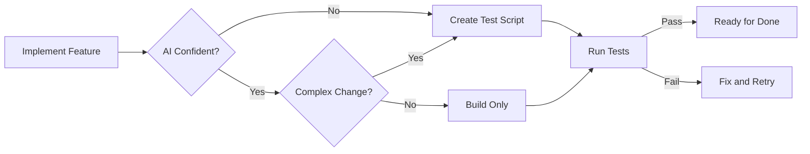

# 📋 flowcrate Kanban Workflow Stages

```
Backlog → Planned → Ready → Doing → Testing → Done
    ↓         ↓                         ↑
    └─────────┴─── Revision ───────────┘
```

### Stage Definitions

| Stage | Purpose | Has Plan? | User Approved? |
|-------|---------|-----------|----------------|
| **Backlog** | Raw ideas, unplanned | ❌ No | ❌ No |
| **Planned** | Has Implementation Plan, awaiting review | ✅ Yes | ❌ Pending |
| **Ready** | Approved, waiting to execute | ✅ Yes | ✅ Yes |
| **Doing** | Active implementation | ✅ Yes | ✅ Yes |
| **Testing** | Needs manual verification | ✅ Yes | ✅ Yes |
| **Done** | Complete and verified | ✅ Yes | ✅ Yes |

### 🗃️ Backlog
**What:** Raw ideas - user input or AI-captured suggestions.
**Key:** NO Implementation Plan yet.
**AI Rule:** Do NOT implement. Ask user if they want to proceed → create plan → move to Planned.

> [!IMPORTANT]
> **MANDATORY: Create Detailed Backlog Cards**
> When creating backlog tasks, ALWAYS include:
> 1. **Descriptive title** - Clear, action-oriented
> 2. **Detailed description** - Context, goals, expected output
> 3. **Checklist items** - Seed requirements for future planning

**Backlog Card Creation Workflow:**
```bash
# Step 1: Create with detailed description
flowcrate create "Feature Title" -t feat -p 2 \
  -d "Context and goal. Expected output: [specific deliverable]." \
  --json | Out-String

# Step 2: Add checklist items as seed requirements
flowcrate checklist add <id> "Requirement 1" --json | Out-String
flowcrate checklist add <id> "Requirement 2" --json | Out-String
flowcrate checklist add <id> "Expected output/deliverable" --json | Out-String
```

> [!TIP]
> **Well-structured backlog cards = faster planning later.** The checklist items become seeds for the Implementation Plan.

### 📝 Planned  
**What:** Tasks WITH Implementation Plan (linked .md), awaiting user review.
**Key:** Plan exists, user hasn't approved.
**AI Rule:** NEVER code while in Planned. Notify user: "Plan ready for review at [path]".

> [!IMPORTANT]
> **Before Creating Plan - INSPECT CARD FIRST:**
> ```bash
> flowcrate show <id> --json | Out-String
> flowcrate checklist list <id> --json | Out-String
> ```
> AI MUST review:
> - **Description**: Context and goals
> - **Checklist**: Seed requirements to address in plan
> - **Priority/Type**: Affects plan detail level

> [!CAUTION]
> **MANDATORY: RAG Search Before Creating Plan**
> Before creating any implementation plan, ALWAYS search for similar Done cards to get context from past implementations:
> ```bash
> flowcrate rag "<keywords from task title>" --limit 5 --json | Out-String
> ```
> AI MUST:
> - Search with relevant keywords from task title/description
> - Review returned Done cards for patterns/approaches
> - Inject relevant references in plan: `> **Reference Cards:** feat-abc1 implemented X, follow similar pattern.`

> [!CAUTION]
> **MANDATORY AUTO-MOVE**: After linking a plan to a Backlog task using `flowcrate update <id> --plan`, you MUST immediately move it to Planned:
> ```bash
> flowcrate update <id> --plan ".flowcrate/plans/FEAT_XXX.md" --json | Out-String
> flowcrate move <id> planned --json | Out-String  # ← MUST DO THIS!
> ```

> [!NOTE]
> **Checklist vs Plan**: Checklist items from Backlog are *seeds*, not mandatory scope. The Implementation Plan is the **source of truth**. Plan may expand beyond original checklist. At Done, verify items *addressed in plan* are complete — unchecked seed items that were "out of scope" are OK.

---

### ✅ Ready
**What:** Approved tasks waiting for execution slot.
**Key:** User approved (said "ok", "approved", "lanjut", or moved manually).
**AI Rule:** Pick from Ready to start work. User may still change requirements (no code yet).

### 🔨 Doing
**What:** Actively being implemented.
**Key:** Must have passed through Ready (or directly from Backlog for trivial/bug fixes).

> [!CAUTION]
> **AI Rule - ABSOLUTELY MANDATORY:**
> 1. **IMMEDIATE ACTION**: Move to `Doing` *before* writing ANY code, running ANY build, or making ANY file changes.
> 2. **NO EXCEPTIONS**: Even for "quick fixes", "typos", or "one-liner" changes - ALWAYS move to Doing first.
> 3. **VERIFY TIMER**: After `flowcrate move <id> doing`, confirm `isTimerRunning: true` in JSON output.
> 4. **NO JUMPING**: Never skip `Doing`. **NEVER** move `Backlog → Done` or `Ready → Done` directly.
>
> **Consequence of violation:** Time not tracked = metrics corrupted = user cannot see actual effort.

> [!WARNING]
> **Pre-Flight File Size Check (MANDATORY):**
> Before editing any file, check line count:
> - **< 500 lines**: ✅ OK - Normal development
> - **500-800 lines**: ⚠️ WARN - Note for potential splitting
> - **800-1000 lines**: 🔴 REVIEW - Flag to user, suggest refactor
> - **> 1000 lines**: 🚫 STOP - Create refactor task before adding more code
>
> See `coding-principles.md` → "📏 File Size & Refactoring Rules"

### 🧪 Testing
**What:** Implementation complete, needs manual verification.
**Key:** AI cannot auto-verify (UI, complex interactions).
**AI Rule:** Wait for user confirmation ("works", "bagus") before Done.

**Skip Testing, go directly to Done when:**
- Build/lint passes for simple fixes
- CLI command verifiable in terminal
- Trivial/obvious change

### ✔️ Done
**What:** Complete, verified, ready to commit.

> [!CAUTION]
> **MANDATORY Done Checklist** - AI MUST complete ALL before notifying user:

| Step | Command/Action | Required? |
|------|---------------|-----------|
| 1. Update Plan Status | Edit plan file: `> **Status**: ✅ DONE` | ✅ ALWAYS |
| 2. Toggle Checklist | Mark items addressed in plan as done (via GUI or CLI) | ✅ IF checklist exists |
| 3. Run Tests | `cargo test --lib` or `pnpm test` | ✅ IF code changed |
| 4. Create Walkthrough | Document results in `.flowcrate/walkthroughs/` | ✅ IF phase/complex task |
| 5. Link Walkthrough | `flowcrate update <id> --walkthrough "<path>"` | ✅ IF walkthrough created |
| 6. Move Task | `flowcrate move <id> done` | ✅ ALWAYS |
| 7. Commit Changes | `git add . ; git commit -m "..."` | ✅ IF code changed |
| 8. Attach Commit | `flowcrate commit <id>` (auto) or `--sha <sha>` | ✅ IF code changed |

**Walkthrough Creation Rules:**
| Task Type | Walkthrough Required? | Content |
|-----------|----------------------|---------|
| **Phase completion** | ✅ YES (MANDATORY) | Test results, changes made, screenshots |
| Feature with tests | ✅ YES | Test output, verification proof |
| Bug fix with test | ✅ YES | Before/after, test proof |
| Simple config change | ❌ No | - |
| Trivial typo fix | ❌ No | - |

**AI MUST NOT:**
- ❌ Move task to Done without updating plan status first
- ❌ Leave checklist items unchecked when they were addressed in plan
- ❌ Complete a phase without creating a walkthrough
- ❌ Commit without running tests (if code changed)
- ❌ Forget to link walkthrough when one was created
- ❌ Leave plan status as "IN PROGRESS" or "PLANNING" after completion
- ❌ Notify user about completion before running this checklist

### 📊 Confidence Score Badge (on Task Cards)

> [!NOTE]
> Task cards display a **Confidence Score Badge** extracted from the linked plan's frontmatter (`> **Confidence**: ~97%`).

**Badge Display Logic:**

| Task Status | Badge Display | Color | Tooltip |
|-------------|---------------|-------|------------|
| **Done** | ✓ | 🟢 Green | "Completed - Task delivered and verified" |
| **Planning/Ready** (97%+) | 97% | 🟢 Green | "Ready for approval" |
| **Planning/Ready** (90-96%) | 92% | 🟡 Yellow | "Review recommended" |
| **Planning/Ready** (<90%) | 85% | 🔴 Red | "Needs more detail" |

**AI Agent Rules:**
- ✅ **Include `> **Confidence**: ~XX%`** in plan frontmatter
- ✅ For Done cards, badge auto-shows ✓ (complete) - no action needed
- ✅ Update plan status to ✅ DONE when moving task to done
- ❌ Do NOT leave stale confidence % in Done plans (status update triggers ✓ display)

### 🧪 Test Script Creation Workflow

> [!IMPORTANT]
> **AI MUST create test scripts** for features/fixes being implemented, especially when:
> - Implementing complex logic or business rules
> - AI is not 100% confident the implementation is correct
> - Changes affect multiple components or have side effects
> - Bug fixes (test should prove the bug is fixed)

**Test Location:**
```
src-tauri/src/tests.rs    # Rust unit tests
src-ui/__tests__/         # TypeScript/SolidJS tests
```

**Test Creation Flow:**


**Test Script Requirements:**
| Change Type | Test Required | Test Coverage |
|-------------|---------------|---------------|
| Bug fix | ✅ YES | Test for specific bug scenario |
| New feature | ✅ YES | Test core functionality |
| Refactor | ✅ Existing | Ensure existing tests pass |
| API change | ✅ YES | Test input/output contracts |
| Config only | ❌ No | Build verification sufficient |

**Example Test for Bug Fix:**
```rust
#[test]
fn test_bug_fix_sync_only_gemini_md() {
    // Setup: Create both GEMINI.md and AGENT.md
    // Action: Call sync function
    // Assert: Only GEMINI.md is synced
}
```
